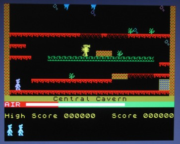

ZX Spectrum emulator using FabGL
===========================

The great FabGL library created by Fabrizio Di Vittorio delivers above all graphics library for ESP32 in conjunction with a VGA monitor. In addition to its own library, on the basis of which you can build your own project, it also contains a number of examples for library usage. Among them are emulators of old 8-bit computers from the era about 40 years ago. E.g. here you will find computers Altair 8800, Commodore VIC-20 and even a 16-bit IBM XT computer with a number of optional operating systems.

The ZX Spectrum microcomputer (see e.g. at https://en.wikipedia.org/wiki/ZX_Spectrum ) is very famous all over the world. Even today, it has a number of supporters and fans who take care of the original microcomputer or play legendary games in various emulators. If you would like to try something similar, you can find emulators for ESP32 on the Internet. The version of the ZX Spectrum computer emulator presented here is among the simpler, but fully sufficient options for testing or remembering.

ZX Spectrum emulator requirements
---------------------------

*   On the HW side, the ESP32 WROVER module must be connected according to the diagram on the website http://www.fabglib.org . It is necessary to connect a VGA monitor and PS2 keyboard.
*   Install the Arduino IDE (tested with version 1.8.13 up to 1.8.19) with ESP32 support. The Arduino IDE must be supplemented with the FabGL library.
*   Place the folder that contains the two files DirectZXSpectrum.ino and romSinclair48K.h in the folder where Arduino saves projects on your computer.
*   After opening the project, you should be able to load the program into the ESP32 memory (instructions are on the website). The settings are the same as for the other computers in the examples FabGL shown in video tutorials.
*   To take advantage of the "cassette tape" program upload feature, install and use the ESP32 Filesystem Uploader for Arduino module to upload SPIFFS content (e.g. https://randomnerdtutorials.com/install-esp32-filesystem-uploader- arduino-ide ).
*   A microSD card is not required for the function.

The principle of the emulator program
-------------------------------------

The program mainly uses FabGL library classes for work. The graphical interface of the application is made up of the drawScanline function, which prepares individual points for display on a VGA monitor. Key presses on the connected PS2 keyboard are handled in the processKeyDown and processKeyUp functions. The actual emulation of the Z80 processor is done by an instance of the Z80 class.

The second library used in the program is SPIFFS. This serves to create a "cassette tape recorder". Programs that would be read from cassette are read from ESP32 memory within SPIFFS as xxxx.SNA files, where "xxxx" specifies the name entered in the ZX Spectrum's "LOAD" command. Stored data (files on "cassette tape") remain in ESP32 memory until you overwrite them.

You can load multiple programs in .SNA format onto a "cassette tape". An example of 5 tested games is listed in the "data" directory for you to try.

Using an emulator
-----------------

The emulator can be controlled via a connected PS2 keyboard. The Esc key resets the processor and the entire computer, the Shift and Ctrl keys switch function keys. An additional 38 keys are active on the keyboard, corresponding to the ZX Spectrum keys. It is necessary to search for the instruction manual of the microcomputer on the web.

If you have an MCP23S17 expander connected to SPI, you can connect the PORTA of the expander directly against the GND through the joystick buttons (see https://wiki.specnext.dev/Kempston_Joystick ). Then you should be able to control the games not only with the keyboard, but also with the joystick.

Load the program from the "cassette tape recorder" into the memory with the LOAD command - eg LOAD "MANIC". Saving data to the "tape recorder" is not implemented, the SAVE command does not work.

Conclusion
----------

In the FabGL library users gained a powerful tool for creating not only their own projects, but in the examples of emulated computers also a lot of older software created for completely different devices many years ago.

References
----------

http://www.fabglib.org  
https://github.com/fdivitto/FabGL  

* * *

Emulátor ZX Spectrum pomocí FabGL
============================

Skvělá FabGL knihovna, kterou vytvořil Fabrizio Di Vittorio, přináší především grafickou knihovnu pro ESP32 ve spojení s VGA monitorem. Kromě vlastní knihovny, na jejímž základě můžete postavit vlastní projekt, obsahuje i řadu příkladů pro použití knihovny. Mezi nimi jsou i emulátory starých 8bitových počítačů z doby před asi 40 lety. Např. zde najdete počítače Altair 8800, Commodore VIC-20 a dokonce i 16bitový počítač IBM XT s řadou volitelných operačních systémů.

Mikropočítač ZX Spectrum (viz např. na https://en.wikipedia.org/wiki/ZX_Spectrum ) je velmi známý po celém světě. I v současnosti má řadu příznivců a fanoušků, kteří opečovávají originální mikropočítač nebo si pouštějí legendární hry v různých emulátorech. Pokud byste chtěli něco podobného vyzkoušet, najdete na internetu emulátory i pro ESP32. Zde uvedená verze emulátoru počítače ZX Spectrum patří mezi jednodušší, ale pro vyzkoušení nebo vzpomínku plně dostačující variantu.

Požadavky pro emulátor ZX Spectrum
----------------------------

*   Po HW stránce musí být modul ESP32 WROVER zapojený podle schéma na stránkách http://www.fabglib.org . K modulu je potřeba připojit VGA monitor a PS2 klávesnici.  Pokud je k dispozici i obvod expanderu MCP23S17 emuluje rozhraní pro připojení Kempston joysticku.
*   Na osobním počítači musí být instalováno Arduino IDE (testováno s verzí 1.8.13 až 1.8.19) s podporou ESP32. Arduino IDE se doplní o knihovnu FabGL.
*   Složku, která obsahuje dva soubory DirectZXSpectrum.ino a romSinclair48K.h umístěte do složky, kam Arduino ukládá na vašem počítači projekty.
*   Po otevření projektu byste měli být schopni nahrát program do paměti ESP32 (návody jsou na webu). Nastavení je stejné jako u dalších počítačů v příkladech FabGL ukázaných ve video návodech.
*   Chcete-li využívat funkci nahrávání programů z "kazetového magnetofonu", instalujte a použijte modul ESP32 Filesystem Uploader pro Arduino, abyste nahráli obsah SPIFFS (návod je např. na https://randomnerdtutorials.com/install-esp32-filesystem-uploader-arduino-ide ).
*   Pro funkci není potřeba mikroSD karta.

Princip programu emulátoru
--------------------------

Program využívá pro práci především třídy knihovny FabGL. Grafické rozhraní aplikace je tvořeno funkcí drawScanline, která připravuje jednotlivé body pro zobrazení na VGA monitoru. Zmáčknutí klávesy na připojené klávesnici PS2 je zpracováno ve funkcích procesKeyDown a procesKeyUp. Vlastní emulaci procesoru Z80 provádí instance třídy Z80.

Druhou knihovnou použitou v programu je SPIFFS. Ta slouží k vytvoření "kazetového magnetofonu". Programy, které by se četly z kazety, jsou v rámci SPIFFS čteny z paměti ESP32 jako soubory xxxx.SNA, kde "xxxx" určuje jméno zadávané v příkazu "LOAD" počítače ZX Spectrum. Uložená data (soubory na "pásce kazetového magnetofonu") zůstávají v paměti ESP32 do doby, než je přepíšete.

Na "kazetový pásek" si můžete nahrát více programů ve formátu .SNA. V adresáři "data" je pro vyzkoušení uveden příklad 5 otestovaných her.

Použití emulátoru
-----------------

Emulátor je možné ovládat přes připojenou klávesnici PS2. Klávesa Esc vyvolá reset procesoru a celého počítače, klávesy Shift a Ctrl přepínají funkční klávesy. Na klávesnici je aktivních dalších 38 kláves, které odpovídají klávesám ZX Spectrum. Návod k použití mikropočítače je nutné hledat na webu.

Máte-li na SPI připojený expander MCP23S17, můžete na PORTA obvodu připojit přímo proti GND tlačítka joysticku (viz https://wiki.specnext.dev/Kempston_Joystick ). Pak by mělo jít ovládat hry nejen klávesnicí, ale i přes joystick.

Program z "kazetového magnetofonu" nahrajete do paměti příkazem LOAD - např. LOAD "MANIC". Ukládání dat na "magnetofon" není implementováno, příkaz SAVE nefunguje.

Závěr
-----

V knihovně FabGL získali její uživatelé mocný nástroj na tvorbu nejen vlastních projektů, ale jak ukazují příklady emulovaných počítačů i na využití staršího software vytvořeného pro úplně jiná zařízení před mnoha lety.

Použitá literatura
------------------

http://www.fabglib.org  
https://github.com/fdivitto/FabGL